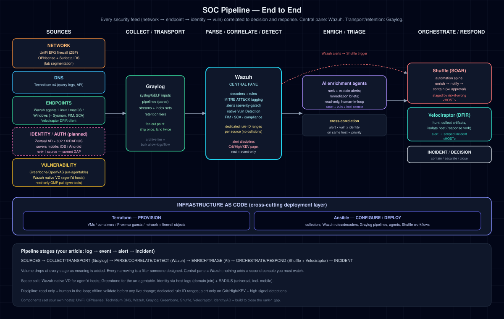

# soc-pipeline (public)

Build an **end-to-end Security Operations pipeline** that brings network, DNS, endpoint, identity, vulnerability, and audit feeds into one detection and investigation model. The design treats each feed as a first-class source in one correlated flow rather than a set of disconnected consoles.

**Reference stack:** firewall / IDS / DNS / endpoints / identity / vulnerability and audit sources → **Graylog** (transport and retention) → **Wazuh** (correlation and detection) → enrichment → **Shuffle** (SOAR) + **Velociraptor** (DFIR) → incident. Collection and enrichment remain read-only through triage. Containment requires human approval.

> This is the **sanitized, adaptable** reference build. It uses placeholders (`<SCANNER_HOST>`, `<WAZUH_HOST>`, `<GMP_USER>`, RFC5737 example networks) so you can drop in your own environment. It carries no real environment data.

## Why

Standing each security tool up as its own silo means another console, another login, and context that never reaches the analyst making the decision. This build treats every tool as **one source in one pipeline**: the same `log → event → alert → incident` path for all of them. Wazuh remains the authoritative detection plane. The read-only Security Visibility Portal provides cross-tool posture, freshness, health, and native-console navigation without duplicating SIEM data or replacing any tool.

Read the reasoning in [`docs/DESIGN.md`](docs/DESIGN.md).

## Feeds in scope

| Domain | Source | Scope note |
|--------|--------|-----------|
| Network | firewall (ZBF) + IDS (Suricata) | denies alert; bulk allows → archive tier |
| DNS | resolver query logs | C2 domains, tunneling, NRD contact |
| Endpoint | SIEM agents + DFIR client | execution, persistence, FIM, SCA |
| Identity | directory auth + 802.1X/RADIUS | rank-1 source; RADIUS = universal, incl. mobile |
| Vulnerability | network scanner + agent-native VD | scanner for un-agentable; native VD for agent'd hosts |

## What you get

- Every feed correlated in one central pane (Wazuh), transported and retained by Graylog.
- **Alert discipline built in:** only Critical / High / KEV and high-signal detections page you; everything else is retained, queryable enrichment.
- **Cross-correlation:** an alert on a host that also has a known critical vuln (or a suspicious identity event) is a higher-priority incident than the same alert on a hardened host.
- **AI enrichment:** dense signal turned into ranked, plain-language triage and remediation.
- **Response:** SOAR workflows (enrich → notify → contain-with-approval) and DFIR (hunt, collect, isolate host).
- **Reproducibility:** portable collectors, deterministic generators, a no-op-by-default Terraform scaffold, eleven non-mutating Ansible role skeletons, tests, sanitization controls, and CI are published.

## Security Visibility Portal

A deployable read-only portal is included under `security_portal/`. It aggregates allowlisted summaries, shows freshness and failure states, and links to native consoles without replacing them. Start with [`config/security-portal.example.json`](config/security-portal.example.json) and [`docs/security-visibility-portal.md`](docs/security-visibility-portal.md).

## Architecture



Full reasoning and stage-by-stage mapping: [`docs/DESIGN.md`](docs/DESIGN.md).

### Vulnerability dashboard (sample)

Point-in-time vulnerability posture rendered from a Greenbone findings feed. This sample uses pseudonymized hosts (`host-NN`) and RFC5737 example addresses; it carries no real environment data. Regenerate from any collector output with `scripts/vuln_dashboard_gen.py`.


See [`docs/vuln-dashboard.md`](docs/vuln-dashboard.md) for the tabular breakdown.

## Build order (efficient + non-disruptive)

Build one feed end-to-end first (the **vulnerability slice**), proving the whole source → Graylog → Wazuh → enrich → respond pattern, then repeat the slice per feed. Every live change is preceded by offline validation (`wazuh-logtest`), a config backup, and read-back verification. IaC is built alongside each phase. Phases:

- **P0** Foundations & access · **P1** Vuln slice (offline build/validate) · **P2** First live change (verified) · **P3** Add source lanes (DNS, firewall/IDS, endpoints, identity) · **P4** Enrich, orchestrate, respond · **P5** Reproducibility & publish

Tracked on the [public project board](https://github.com/users/secdoc/projects/3) and in `docs/`.

## Implementation status

Status below reflects verified work through **2026-09-04**. It distinguishes the tested implementation from artifacts generalized and published here. Internal addresses, credentials, event samples, and environment-specific recovery evidence are not copied into this repository.

| Phase | Verified implementation checkpoint | Public artifact status |
|---|---|---|
| P0, foundations and access | Required source access is substantially complete. The least-privilege DFIR API credential remains outstanding. | The sanitized [Terraform and Ansible scaffold](terraform/README.md) is published with synthetic inventory, import-first controls, eleven non-mutating role skeletons, and native validation. Access tracking remains [in progress](https://github.com/secdoc/soc-pipeline-public/issues/10). |
| P1 and P2, vulnerability slice and first live change | The vulnerability path, dual-consumer delivery, severity gating, stable event identity, dashboards, backup, rollback, and read-back verification are accepted. | The portable collector, rules, dashboard generators, migration helpers, tests, and standalone [Greenbone lane](https://github.com/secdoc/greenbone-wazuh-graylog) are published. |
| P3, source lanes | Seven source lanes have passed target-only delivery acceptance: vulnerability, DNS, WAF, firewall, camera metadata, secrets-manager audit, and password-vault audit. Identity telemetry and endpoint expansion are still in progress. Firewall and IDS sensor placement is intentionally last and requires a traffic-visibility architecture decision first. | Standalone public WAF, Greenbone, and DNS lanes are published. Endpoint [coverage](https://github.com/secdoc/soc-pipeline-public/issues/14), [identity](https://github.com/secdoc/soc-pipeline-public/issues/15), and the final [firewall/IDS lane](https://github.com/secdoc/soc-pipeline-public/issues/13) remain open. |
| P4, enrich and respond | Local-observation enrichment, anti-flood alerting, read-only egress hunting, threat-intelligence context, and enrichment-first SOAR are active. Automatic blocking and host isolation are not enabled. | Core transactional and migration tooling is published. Portable DFIR [investigation and isolation](https://github.com/secdoc/soc-pipeline-public/issues/17) remains open. Default-deny egress is [held](https://github.com/secdoc/soc-pipeline-public/issues/24) until visibility and dependency prerequisites are met. |
| P5, reproduce and publish | A consolidated article has been drafted from tested implementation. Live Terraform adoption and the complete adopter lab remain controlled follow-on work. | The Terraform scaffold and non-mutating Ansible skeletons satisfy [issue 11](https://github.com/secdoc/soc-pipeline-public/issues/11). Complete clean-environment idempotent deployment roles remain open in [issue 18](https://github.com/secdoc/soc-pipeline-public/issues/18), along with the sanitized [build guide](https://github.com/secdoc/soc-pipeline-public/issues/8) and [article publication](https://github.com/secdoc/soc-pipeline-public/issues/9). |

The enterprise Graylog and Wazuh migration is operationally advanced but not represented here as a turnkey cluster installer. Source cutover, high-availability frontends, health checks, backup and restore controls, parser recovery, certificate rotation, and progressive agent migration have been exercised. Remaining endpoint migration, historical-data decisions, and decommission gates are not complete.

## Safety model

- **Read-only through triage.** Collectors and AI agents only read. They never re-run scans or touch hosts.
- **Response is staged.** SOAR/DFIR actions are ordered by risk-if-wrong; enrichment (no downside) first, containment only with human approval.
- **Offline-validate before any live change.** Dedicated SIEM rule-ID ranges per source (no collisions); logtest both ways before load.
- **Secrets never leave; telemetry is treated as hostile.** Credentials stripped before ingest and before any LLM call; service banners are attacker-influenceable (prompt-injection aware).

## Reliability controls

The vulnerability collector advances delivered state only after every configured consumer succeeds. A Graylog or Wazuh failure leaves the batch retryable instead of silently losing it.

Supported delivery modes:

```text
Graylog GELF/TCP
Graylog GELF/TCP with TLS
Graylog GELF/HTTP over verified HTTPS
Wazuh localfile append over SSH
Wazuh newline-delimited JSON over TCP
```

Example target-only invocation:

```bash
python3 collector/run_pipeline.py \
  --socket /tmp/gvmd.sock \
  --graylog-endpoint retention=graylog.example.local:12213:https \
  --graylog-ca /path/to/ca-chain.pem \
  --no-default-graylog \
  --wazuh-endpoint detection=wazuh.example.local:5514:tcp \
  --no-default-wazuh
```

Each finding carries a stable SHA-256 event hash across Graylog, Wazuh, dedupe state, and dashboard cardinality.

## Operational tooling

- `scripts/wazuh_agent_migration.py`: generates activation and rollback scripts that stop the agent, require process exit, validate configuration, start, and verify the intended manager connection.
- `scripts/prepare_socfortress_rules.py`: builds a temporary collision-safe rules bundle from a pinned third-party source. It remaps conflicts, preserves parent references, validates dependencies, and emits a hash manifest.
- `scripts/wazuh_manager_vendor_config.py`: adds required CDB list declarations and supports exact-count hook replacement.
- `scripts/wazuh_dashboard_gen.py`: generates a full-width dashboard with total and distinct stable-finding KPIs.

The SOCFortress source repository did not contain a license file at the reviewed revision. Do not redistribute its rule content without a valid license. The builder itself is Apache-2.0 and does not embed vendor rules.

Validation gates:

```bash
python3 -m unittest discover -s tests -v
python3 scripts/scrub_check.py .
cd terraform && tofu fmt -check -recursive && tofu init -backend=false && tofu validate && tofu test
cd ../ansible && ansible-lint .
```

GitLab is the development source of truth. The verified public state is mirrored to GitHub after its pipeline passes. The CI baseline performs repository integrity checks and centralized malware scanning on an isolated runner.

## Infrastructure as code

- [`terraform/`](terraform/README.md): synthetic Proxmox inventory, reusable VM module, remote-state example, import-first adoption, and no-op tests.
- [`ansible/`](ansible/README.md): eleven non-mutating role skeletons, serial orchestration examples, defaults, and candidate templates. Issue 18 remains open for tested deployment roles.

These are adaptable scaffolds, not permission to apply against an environment. Supply your own inventory and secrets, preserve one-target rollout controls, and validate product configuration before restart.

## Adapting to a different stack

The pipeline is the transferable part. Swap tools per stage — any source with an API, any log platform for transport/retention, any SIEM for correlation, any SOAR/DFIR for response. The stage roles stay the same. See `docs/DESIGN.md`.

## Related projects

- **[socfortress-waf-siem](https://github.com/secdoc/socfortress-waf-siem)** — standalone sanitized build of the WAF lane: wire a SOCFortress WAF (Caddy+Coraza / OWASP CRS) into Wazuh+Graylog (collector, dual delivery, detection rules, dashboard).
- **[greenbone-wazuh-graylog](https://github.com/secdoc/greenbone-wazuh-graylog)** — standalone sanitized build of the vulnerability lane: wire a Greenbone/OpenVAS scanner into Wazuh+Graylog (GMP collector, dual delivery, rules, dashboard, how-tos).
- **[technitium-wazuh-graylog](https://github.com/secdoc/technitium-wazuh-graylog)** — standalone sanitized build of the DNS lane: wire a Technitium DNS server/cluster into Wazuh+Graylog (Query Logs collector, dual delivery, detection enrichments, rules for blocking/NXDOMAIN/DGA/tunneling).

## License

Dual-licensed, **attribution required** under both:

- **Code & configuration** (`collector/`, `wazuh/`, `graylog/`, `ansible/`, `terraform/`, `scripts/`): [Apache License 2.0](LICENSE)
- **Docs, labs & diagrams** (`docs/`, `lab/`, `README`): [CC BY 4.0](LICENSE-docs)

See [`LICENSING.md`](LICENSING.md) and [`NOTICE`](NOTICE). Credit: Lester E. Nichols III, secdoc.tech. Contributions welcome.

## GitLab CI baseline

GitLab CI validates tracked JSON, Python, and shell syntax, then runs a network-independent high-confidence secret scan across full Git history. The public pipeline contains no private registry, runner, credential, CA, or internal-domain reference.

