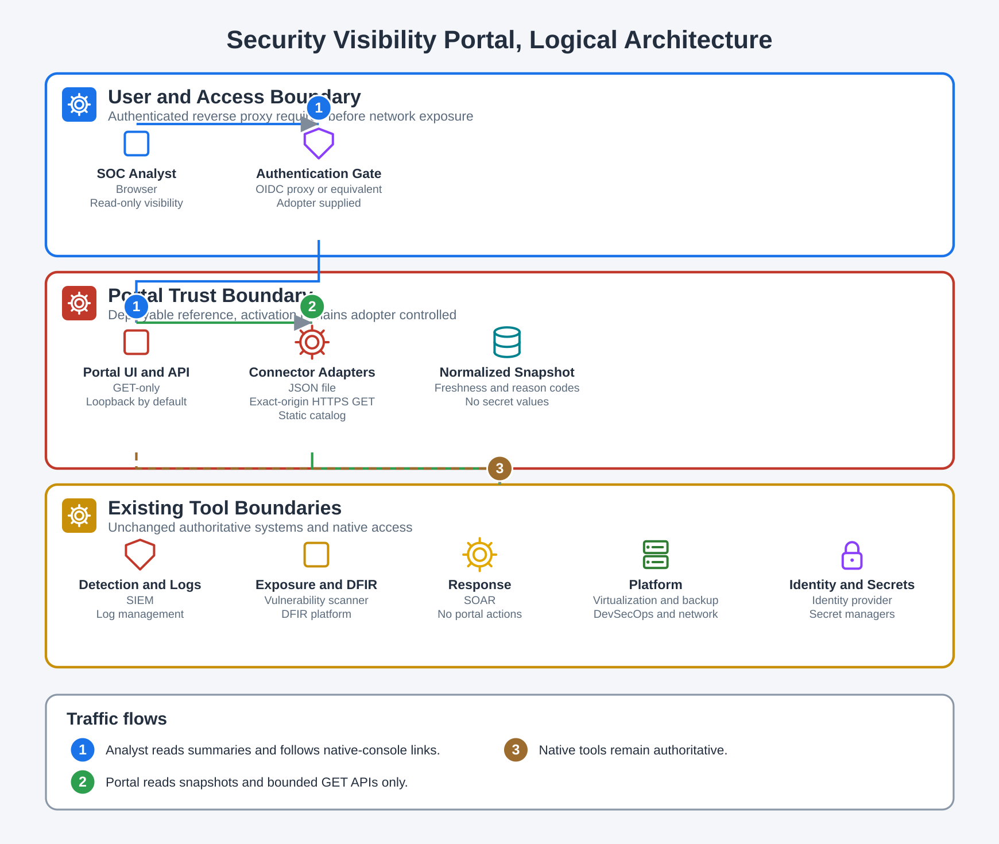
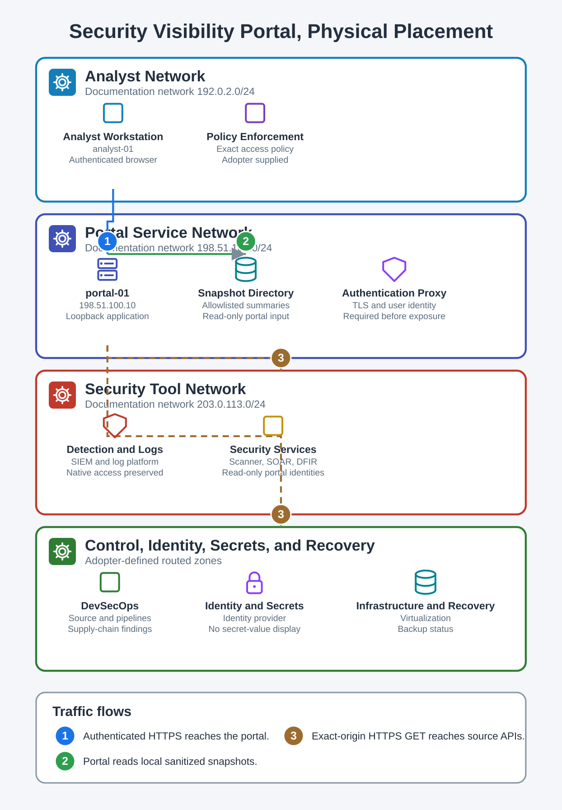

# Security Visibility Portal

Status: deployable reference implementation  
Classification: adopter-defined  
State date: 2026-09-04 UTC

## Purpose

This portal provides centralized, read-only security visibility without replacing native SIEM, log-management, vulnerability, SOAR, DFIR, infrastructure, identity, secrets, or network consoles. It normalizes small allowlisted summaries and links analysts back to the source system for investigation and administration.

## What is implemented

* Dependency-free Python service and self-contained browser UI.
* Versioned JSON API and process health routes.
* JSON-file, HTTPS JSON GET, and explicit static catalog connectors.
* Exact scheme, host, and port allowlists for HTTP connectors.
* Redirect refusal so credentials do not cross to an unreviewed target.
* Distinct healthy, degraded, stale, unavailable, unauthorized, unknown, and planned states.
* GET-only server. POST, PUT, PATCH, and DELETE return 405.
* Browser security headers and DOM text rendering that does not interpret source values as HTML.
* Hardened systemd and Caddy examples.
* Unit, HTTP, configuration, and failure-state tests.

## Architecture





The portal is a stateless modular monolith:

```text
analyst browser
    |
authenticated TLS reverse proxy
    |
loopback portal UI and GET-only API
    |
normalization and freshness model
    |
+-- read-only JSON snapshots
+-- exact-origin HTTPS GET APIs
+-- planned/static tool catalog
    |
native consoles remain authoritative
```

The portal does not store source telemetry, execute response actions, or become a new SIEM. A source request alone cannot produce a healthy state. Healthy evidence needs an explicit healthy signal and valid timestamp. Old evidence becomes stale, missing time becomes unknown, HTTP 401 or 403 becomes unauthorized, and other retrieval failures become unavailable.

## Quick start

Run the complete test suite:

```bash
python3 -m unittest discover -s tests -v
```

Validate and collect the sample configuration. Copy the sample snapshot first:

```bash
install -d -m 0750 /var/lib/security-portal/snapshots
install -m 0640 samples/security-portal-siem-health.json /var/lib/security-portal/snapshots/siem-health.json
python3 scripts/security_portal_validate.py --config config/security-portal.example.json --collect
```

The sample HTTP connector intentionally references an example endpoint and will report unavailable unless you replace it. This is a visible failure state, not a failed installation.

Start on loopback:

```bash
python3 -m security_portal.server \
  --config config/security-portal.example.json \
  --bind localhost \
  --port 8080
```

Then verify:

```bash
curl --fail http://localhost:8080/healthz
curl --fail http://localhost:8080/api/v1/overview
```

Do not bind to a network address. Put an authenticated TLS reverse proxy in front of the loopback listener first.

## Configuration contract

Every integration requires a unique `id`, display `name`, `category`, connector type, and positive `max_age_seconds`.

JSON-file connectors require a path and should use a dedicated producer-generated snapshot. Grant the portal account read-only access only to the exact snapshot directory.

HTTP JSON connectors require `url` and `allowed_origins`. An origin is matched by exact scheme, host, and effective port. Only GET is supported and redirects are refused. Normal certificate validation is enabled. Use `ca_file` for a private CA. `header_env` maps an HTTP header name to an environment variable name. Secret values never belong in the JSON config.

Static connectors are explicit catalog entries. Use `planned` when a tool is linked but has no data connector. A static entry is not health evidence.

`summary_paths` is the data-release allowlist. Do not pass complete source responses to the browser.

## API

| Route | Method | Meaning |
|---|---|---|
| `/` | GET | Browser dashboard |
| `/api/v1/overview` | GET | Portal metadata, posture, integrations |
| `/api/v1/integrations` | GET | Compatibility alias |
| `/healthz` | GET | Process health |
| `/readyz` | GET | Configuration-loaded readiness |

## Deployment

1. Install the repository at `/srv/example/security-portal`.
2. Create a locked `security-portal` service account.
3. Copy the validated config to `/etc/security-portal/config.json` with no secret values.
4. Create `/var/lib/security-portal/snapshots` and grant only required read access.
5. Install `deploy/security-portal.service.example` as a local systemd unit.
6. Start on loopback and run positive and negative HTTP checks.
7. Configure an authenticated TLS reverse proxy. The Caddy example is a policy placeholder, not a complete identity integration.
8. Prove unauthenticated denial, authorized access, logout, session expiry, and role policy.
9. Add exact egress permits and one connector at a time.
10. Enable the service only after audit logging and rollback tests pass.

## Operations

For every connector, record the metric owner, source field, freshness threshold, service identity owner, secret rotation interval, network destination, and rollback. Test healthy, degraded, stale, unauthorized, unavailable, and malformed source responses.

Send portal request status and connector reason codes to the existing log platform. Never log headers, tokens, full query strings, or source payloads.

## Backup and recovery

The portal is stateless. Back up versioned code, non-secret configuration, service definition, proxy policy, and connector ownership records. Do not duplicate source telemetry into the portal backup.

Rebuild by checking out the accepted revision, recreating the service identity, restoring non-secret config, re-establishing read-only snapshot access and secret references, testing on loopback, then restoring the authenticated route.

## Rollback

Remove the proxy route first, stop the portal, restore the previous code and config, and remove connector-only identities or egress permits. Native consoles remain the operational fallback and must not depend on portal availability.

## Security boundaries

The portal exposes visibility only. It does not execute SOAR workflows, isolate hosts, change firewall policy, rerun scans, alter identity, or retrieve secret values. If mutating actions are later required, build a separately reviewed response control plane with stronger authorization and approval semantics.

The standard-library threaded server is suitable for low-concurrency internal use behind a trusted reverse proxy. At higher load, move collection to scheduled snapshot producers and use a production ASGI server. Do not expose this implementation directly to the Internet.
