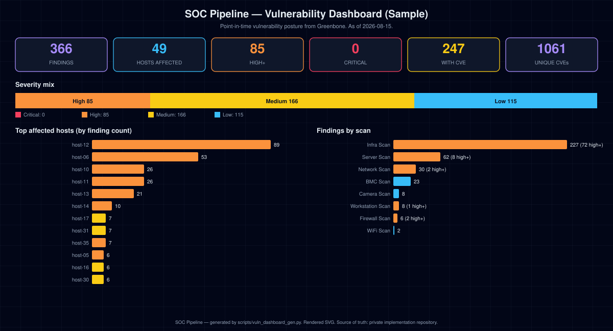

# SOC Pipeline — Vulnerability Dashboard (Sample)

> **Point-in-time vulnerability posture** from Greenbone, 366 findings across 49 hosts. **85** are High or Critical. As of **2026-08-15**.

*Data class: SANITIZED / SYNTHETIC-SAFE. Generated 2026-08-17 12:48 UTC by `scripts/vuln_dashboard_gen.py`.*

## Key numbers

| Metric | Value |
|---|---|
| Total findings | 366 |
| Hosts affected | 49 |
| Critical (>=9.0) | 0 |
| High (7.0-8.9) | 85 |
| Medium (4.0-6.9) | 166 |
| Low (<4.0) | 115 |
| Findings with a CVE | 247 |
| Unique CVEs | 1061 |

## By scan

| Scan | Findings | High+ |
|---|---|---|
| Infra Scan | 227 | 72 |
| Server Scan | 62 | 8 |
| Network Scan | 30 | 2 |
| BMC Scan | 23 | 0 |
| Camera Scan | 8 | 0 |
| Workstation Scan | 8 | 1 |
| Firewall Scan | 6 | 2 |
| WiFi Scan | 2 | 0 |

## Top affected hosts

| Host | Findings | Max CVSS | Worst |
|---|---|---|---|
| host-12 | 89 | 8.8 | High |
| host-06 | 53 | 7.5 | High |
| host-10 | 26 | 8.8 | High |
| host-11 | 26 | 8.8 | High |
| host-13 | 21 | 8.1 | High |
| host-14 | 10 | 7.5 | High |
| host-17 | 7 | 5.6 | Medium |
| host-31 | 7 | 5.3 | Medium |
| host-35 | 7 | 7.5 | High |
| host-05 | 6 | 7.5 | High |
| host-16 | 6 | 6.4 | Medium |
| host-30 | 6 | 5.4 | Medium |
| host-18 | 5 | 5.3 | Medium |
| host-19 | 5 | 5.0 | Medium |
| host-32 | 5 | 5.1 | Medium |

## Most frequent findings

| Finding | Count | Max CVSS | Severity |
|---|---|---|---|
| ICMP Timestamp Reply Information Disclosure | 43 | 2.1 | Low |
| TCP Timestamps Information Disclosure | 41 | 2.6 | Low |
| Weak MAC Algorithm(s) Supported (SSH) | 26 | 2.6 | Low |
| SSL/TLS: Certificate Expired | 10 | 5.0 | Medium |
| Weak Key Exchange (KEX) Algorithm(s) Supported (SSH) | 4 | 5.3 | Medium |
| SSL/TLS: Renegotiation DoS Vulnerability (CVE-2011-1473, CVE-2011-5094 | 4 | 5.0 | Medium |
| Debian: Security Advisory (DSA-6285-1) | 4 | 7.5 | High |
| Debian: Security Advisory (DSA-6266-1) | 4 | 5.0 | Medium |
| Debian: Security Advisory (DSA-6204-1) | 4 | 5.0 | Medium |
| Debian: Security Advisory (DSA-6293-1) | 4 | 5.0 | Medium |
| Debian: Security Advisory (DSA-6263-1) | 4 | 4.4 | Medium |
| IPMI MD2 Auth Type Support Enabled (IPMI Protocol) | 4 | 5.1 | Medium |
| Weak Host Key Algorithm(s) (SSH) | 3 | 5.3 | Medium |
| Cleartext Transmission of Sensitive Information via HTTP | 3 | 4.8 | Medium |
| SSL/TLS: Deprecated TLSv1.0 and TLSv1.1 Protocol Detection | 3 | 4.3 | Medium |

## Remediation posture (by solution type)

| Solution type | Findings |
|---|---|
| VendorFix | 187 |
| Mitigation | 163 |
| Workaround | 12 |
| WillNotFix | 4 |

*Source of truth: `private implementation repository`.*
*Last generated: 2026-08-17 12:48 UTC.*
